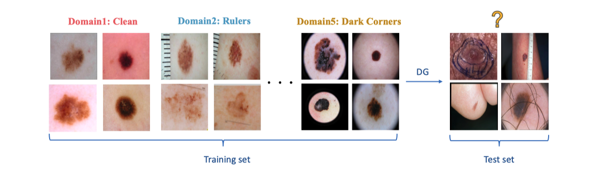
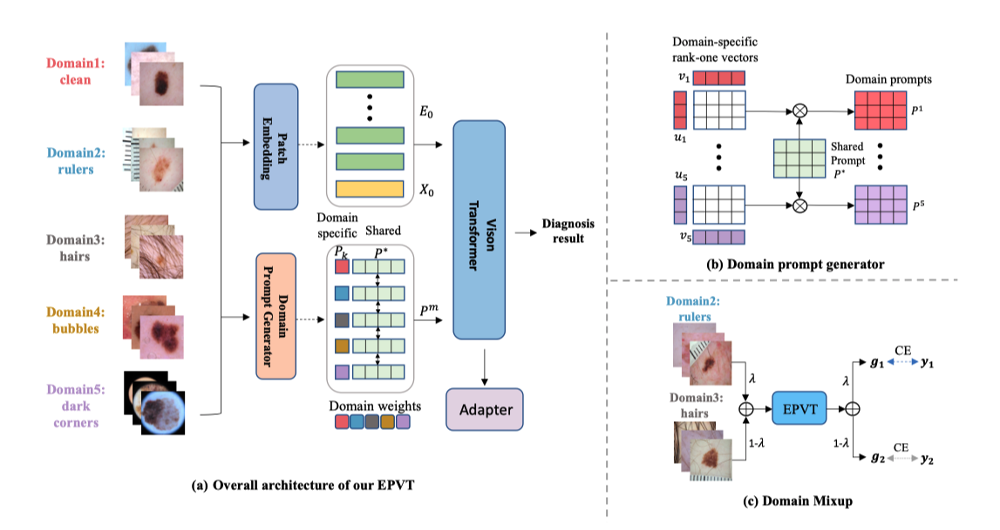

# EPVT


Pytorch implementation of our **MICCAI2023** paper **Environment-aware Prompt Vision Transformer for Domain Generalization in Skin Lesion Recognition ** ([Environment-aware Prompt Vision Transformer for Domain Generalization in Skin Lesion Recognition](https://arxiv.org/pdf/2304.01508.pdf)) and a domain generalization benchmark for skin lesion recognition.
## Motivation

## Method


## Training

Refer to [DomainBed Readme](README_domainbed.md) for more details on commands running jobs. The training setting sweeps across multiple hyperparameters. Here we select some hyperparameters that can reach a good result. (Update 17/11/22: as many queries about the ERM baseline hyper-parameter, we present them below.)

```sh
# OfficeHome ERM
python -m domainbed.scripts.train --data_dir=./domainbed/data/ --steps 5001 --dataset OfficeHome --test_env 0/1/2/3 --algorithm DoPrompt --output_dir results/exp \
     --hparams '{"lr": 1e-5, "lr_classifier": 1e-4}'
# OfficeHome
python -m domainbed.scripts.train --data_dir=./domainbed/data/ --steps 5001 --dataset OfficeHome --test_env 0/1/2/3 --algorithm DoPrompt --output_dir results/exp \
     --hparams '{"lr": 1e-5, "lr_classifier": 1e-3}'
# PACS ERM
python -m domainbed.scripts.train --data_dir=./domainbed/data/ --steps 5001 --dataset PACS --test_env 0/2/3 --algorithm DoPrompt --output_dir results/exp \
     --hparams '{"lr": 5e-6, "lr_classifier": 5e-5}'
# PACS
python -m domainbed.scripts.train --data_dir=./domainbed/data/ --steps 5001 --dataset PACS --test_env 0/2/3 --algorithm DoPrompt --output_dir results/exp \
     --hparams '{"lr": 5e-6, "lr_classifier": 5e-4}'
# VLCS ERM
python -m domainbed.scripts.train --data_dir=./domainbed/data/ --steps 5001 --dataset VLCS --test_env 0/1/2/3 --algorithm DoPrompt --output_dir results/exp \
     --hparams '{"lr": 5e-6, "lr_classifier": 5e-5}'
# VLCS
python -m domainbed.scripts.train --data_dir=./domainbed/data/ --steps 5001 --dataset VLCS --test_env 0/1/2/3 --algorithm DoPrompt --output_dir results/exp \
     --hparams '{"lr": 5e-6, "lr_classifier": 5e-6}'
```

## Collect Results

```sh
python -m domainbed.scripts.collect_results --input_dir=results
```

## Requirements

```sh
pip install -r requirements.txt
```

## Citation

```bibtex
@article{zheng2022prompt,
  title={Prompt Vision Transformer for Domain Generalization},
  author={Zheng, Zangwei and Yue, Xiangyu and Wang, Kai and You, Yang},
  journal={arXiv preprint arXiv:2208.08914},
  year={2022}
}
```

## TODO

- Details about preparing the datasets.


## Citation

```bibtex
@misc{yan2023epvt,
      title={EPVT: Environment-aware Prompt Vision Transformer for Domain Generalization in Skin Lesion Recognition}, 
      author={Siyuan Yan and Chi Liu and Zhen Yu and Lie Ju and Dwarikanath Mahapatrainst and Victoria Mar and Monika Janda and Peter Soyer and Zongyuan Ge},
      year={2023},
      eprint={2304.01508},
      archivePrefix={arXiv},
      primaryClass={cs.CV}
}
```

## Acknowlegdement

This code is built on [DomainBed](https://github.com/facebookresearch/DomainBed), [DoPrompt](https://github.com/zhengzangw/DoPrompt), and [DG_SKIN](https://github.com/alceubissoto/artifact-generalization-skin) . We thank the authors for sharing their codes.
